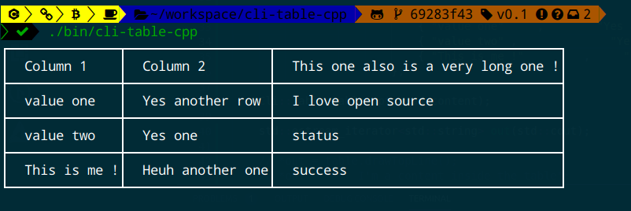
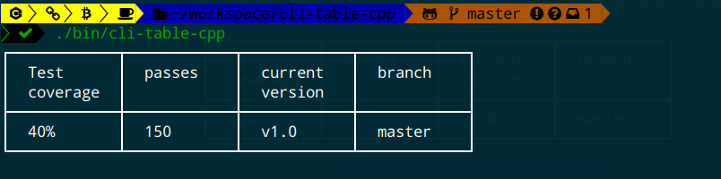

# cli-table-cpp
Pretty unicode tables for the CLI with CPP

I was looking for a simple and beautiful unicode table for the CLI for a toy 
project written in C++ but didn't found one that satisfy my needs then I build one :smile:
Base on this [JavaScript project](https://github.com/Automattic/cli-table) .

# Compiling and Running the tests 

  ## Requirements 

  - CMAKE 3.10 or greater
  - Clang or G++ 7.3.0 (That supports C++17)
  - Conan - C++ package manager, needed if you want to run tests
  
## Compiling 

If all requirements are met then you can build using cmake :

``` cmake --build . ```

The resulting binary will be the located in the `bin` folder.

## Basic usage 

You need first to include the header files `Table.hpp` and `Utils.hpp`.

```cpp

    #include <iostream>
    #include "Table.hpp"
    #include "Utils.hpp"
    #include <string>

    // Options for the table to draw
    Cli::opt opt;
    // Contructing the table structure
    TableBody content = {
                            { "value \nmultilines ?"     ,        "Nope \njust \ntesting" },
                            { "value Yes\n are you sure?" ,              "Teufy"      },
                            { "This \nis me !"         ,     "Heuh \nanother one"  },
                            { "value \nmultilines ?"     ,        "Nope \njust \ntesting" },
                            { "value Yes\n are you sure?" ,              "Teufy"      },
                        };
    // Or you can use the push() method 

    content.push( { "This \nis me !"         ,     "Heuh \nanother one"  }, );

    Cli::Table table(opt,content);
    //Generating the final table 

    table.generate();
    
```

     
# Result after running binary

Here is the result in image of what you can get after running the tests or after your own customization: 




  
# Contributing 

If you found a bug or want to add a new feature, create a new branch and work on it 
after when it's ready open a pull request and after reviewing the branch will be merge into the master 
branch.
